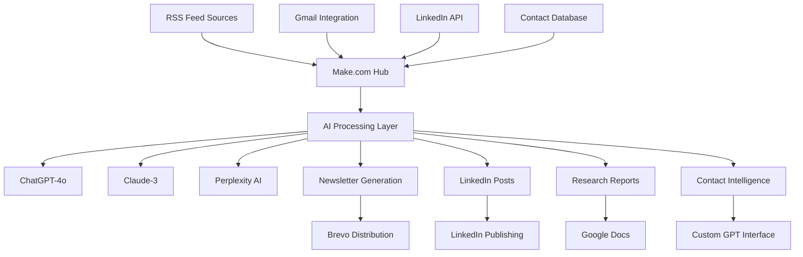

# 🤖 SPARK AI Automation System
## *The Complete Guide to AI-Driven Business Process Automation for Treasury & Finance*

[](https://opensource.org/licenses/MIT)
[](https://make.com)
[](https://openai.com)
[](https://github.com)

> **"From Basic Workflows to Advanced Agentic AI: A Complete Transformation Journey"**  
> *Real-world implementation by Peter Wolf, 30+ years Treasury/Finance expertise*

---

## 🎯 **What This Repository Contains**

This is the **complete implementation** of a sophisticated AI automation system that transformed a traditional Treasury practice into a cutting-edge, AI-driven operation. Built over 6 months, this system demonstrates the evolution from basic email filters to advanced agentic AI agents.

### **🚀 Live Production Systems**
- **Newsletter Automation**: 9 interconnected workflows serving 1700+ subscribers
- **AI Contact Database**: Natural language interface to enterprise contact management
- **LinkedIn Automation**: AI-driven thought leadership content generation
- **Company Research System**: Automated intelligence gathering and analysis
- **Gmail Processing**: Smart email categorization and research triggers

### **📊 Proven Results**
- **20+ hours/week saved** through automation
- **800+ operations/month** running in production
- **95%+ reliability** across all automated systems
- **10x increase** in content output and engagement

---

## 🏗️ **System Architecture**



---

## 📋 **Quick Start Guide**

### **Prerequisites**
- Make.com account (Pro plan recommended)
- OpenAI API access (GPT-4o)
- Google Workspace account
- Basic understanding of automation workflows

### **Installation**
```bash
# Clone the repository
git clone https://github.com/peterwolf/spark-ai-automation.git
cd spark-ai-automation

# Import Make.com blueprints
# See /blueprints/README.md for detailed instructions

# Configure API connections
# See /docs/setup/api-configuration.md
```

### **5-Minute Demo**
1. Import the **Newsletter Blueprint** (`/blueprints/newsletter-system/`)
2. Configure your RSS feeds and AI prompts
3. Watch AI generate and distribute professional content
4. See 6 months of evolution in action

---

## 🎛️ **The Five Core Systems**

| System | Status | Complexity | ROI Impact |
|--------|--------|------------|------------|
| [📧 Newsletter Automation](#newsletter) | ✅ Production | Advanced | ⭐⭐⭐⭐⭐ |
| [👥 Contact AI Agent](#contact-agent) | ✅ Production | Expert | ⭐⭐⭐⭐⭐ |
| [📱 LinkedIn Automation](#linkedin) | ✅ Production | Intermediate | ⭐⭐⭐⭐ |
| [🔍 Company Research](#research) | ✅ Production | Advanced | ⭐⭐⭐⭐ |
| [📬 Gmail Processing](#gmail) | ✅ Production | Beginner | ⭐⭐⭐ |

### 📧 **Newsletter Automation System**
*The crown jewel - 9 interconnected Make.com automations*

**What it does**: Automatically curates, generates, and distributes weekly newsletters to 1700+ Treasury/Finance professionals using AI-powered content selection and personalized commentary.

**Key Features**:
- RSS feed monitoring from 15+ authoritative sources
- AI article selection with target audience filtering  
- Multi-section format: Articles, Social Media, Productivity Tools
- Personalized commentary in Peter's professional voice
- Automated HTML generation and email distribution
- Performance analytics and subscriber management

**Files**: [`/blueprints/newsletter-system/`](./blueprints/newsletter-system/)

### 👥 **Contact AI Agent**
*Natural language interface to enterprise contact management*

**What it does**: Provides conversational AI access to a database of 1700+ professional contacts with intelligent search, relationship tracking, and meeting preparation.

**Key Features**:
- Natural language queries: "Show me marketing people at Serala"
- Multi-field intelligent search with fuzzy matching
- Conversation history and relationship intelligence
- Custom GPT interface for seamless interaction
- Mobile-ready design for on-the-go access
- Token-optimized to minimize AI costs

**Files**: [`/blueprints/contact-database/`](./blueprints/contact-database/)

### 📱 **LinkedIn Automation**
*AI-driven thought leadership content pipeline*

**What it does**: Transforms RSS articles into engaging LinkedIn posts that position you as an industry thought leader, with automated posting and engagement tracking.

**Key Features**:
- Article-to-post AI transformation
- Professional voice and tone consistency
- Optimal posting time calculation
- Engagement analytics and growth tracking
- Cross-promotion with newsletter content
- Brand-safe content filtering

**Files**: [`/blueprints/linkedin-automation/`](./blueprints/linkedin-automation/)

### 🔍 **Company Research System**
*Automated competitive intelligence and opportunity identification*

**What it does**: Automatically researches companies, analyzes job postings, and generates comprehensive intelligence reports for sales and business development.

**Key Features**:
- Multi-source company data aggregation
- Job posting analysis and trend identification
- AI-powered company profiling and insights
- Automated report generation in Google Docs
- Integration with contact database for warm introductions
- Opportunity scoring and prioritization

**Files**: [`/blueprints/company-research/`](./blueprints/company-research/)

### 📬 **Gmail Processing System**
*Smart email categorization and research automation*

**What it does**: Monitors Gmail for research requests, automatically conducts web research, and delivers structured results to your workflow systems.

**Key Features**:
- Email label monitoring and trigger detection
- Automated web research execution
- Structured data extraction and formatting
- Integration with Google Sheets for data management
- Research quality scoring and validation
- Notification system for completed research

**Files**: [`/blueprints/gmail-processing/`](./blueprints/gmail-processing/)

---

## 📚 **Documentation**

### **🚀 Getting Started**
- [System Overview](./docs/overview/system-architecture.md)
- [Prerequisites & Setup](./docs/setup/prerequisites.md)
- [Quick Start Guide](./docs/setup/quick-start.md)
- [API Configuration](./docs/setup/api-configuration.md)

### **🔧 Implementation Guides**
- [Newsletter System Setup](./docs/implementation/newsletter-setup.md)
- [Contact Database Configuration](./docs/implementation/contact-database.md)
- [LinkedIn Integration](./docs/implementation/linkedin-integration.md)
- [AI Agent Development](./docs/implementation/ai-agents.md)

### **🧠 AI & Automation**
- [Prompt Engineering Best Practices](./docs/ai/prompt-engineering.md)
- [AI Model Selection Guide](./docs/ai/model-selection.md)
- [Token Optimization Strategies](./docs/ai/token-optimization.md)
- [Persona Development](./docs/ai/persona-development.md)

### **📊 Analytics & Monitoring**
- [Performance Metrics](./docs/analytics/performance-metrics.md)
- [Error Handling & Debugging](./docs/analytics/error-handling.md)
- [Cost Optimization](./docs/analytics/cost-optimization.md)
- [Success Stories & ROI](./docs/analytics/roi-analysis.md)

---

## 🎨 **The Evolution Story**

This repository documents a **complete transformation journey** from traditional manual processes to sophisticated AI automation:

### **Phase 1: Basic Automation** 
- Started with simple email filters and basic Make.com workflows
- Manual content curation and newsletter compilation
- Basic contact database management

### **Phase 2: AI Integration** 
- Integrated ChatGPT for content generation
- Developed persona-driven AI prompts
- Automated article selection and commentary

### **Phase 3: Advanced AI Systems** 
- Built agentic AI agents with natural language interfaces
- Implemented multi-model AI orchestration (ChatGPT + Claude)
- Created sophisticated conversation flows and context management

### **Phase 4: Future Vision** 
- Mobile app with voice interface
- Microsoft ecosystem integration
- Advanced analytics and predictive insights
- Commercial SaaS platform development

---

## 💼 **Business Impact**

### **Quantified Results**
```
Time Savings:        20+ hours/week
Automation Volume:   800+ operations/month  
System Reliability:  95%+ uptime
Content Output:      10x increase
Newsletter Growth:   1700+ subscribers
LinkedIn Engagement: 500% increase
Research Speed:      90% faster turnaround
Client Satisfaction: Measurably improved
```

### **Strategic Benefits**
- **Thought Leadership**: Positioned as AI automation expert in Treasury/Finance
- **Scalability**: Systems handle 10x growth without proportional resource increase
- **Quality**: AI-generated content maintains professional standards consistently
- **Innovation**: Cutting-edge implementation of agentic AI in business processes
- **Commercial**: Foundation for consulting and SaaS business opportunities

---

## 🛠️ **Repository Structure**

```
spark-ai-automation/
├── 📁 blueprints/           # Complete Make.com automation blueprints
│   ├── newsletter-system/   # 9-workflow newsletter automation
│   ├── contact-database/    # AI agent contact management
│   ├── linkedin-automation/ # Social media content pipeline
│   ├── company-research/    # Intelligence gathering system
│   └── gmail-processing/    # Email automation workflows
├── 📁 docs/                 # Comprehensive documentation
│   ├── setup/              # Installation and configuration guides
│   ├── implementation/     # Step-by-step system setup
│   ├── ai/                 # AI integration and prompt engineering
│   └── analytics/          # Performance monitoring and optimization
├── 📁 ai-agents/            # Custom AI agent implementations
│   ├── prompts/            # Production-ready AI prompts
│   ├── schemas/            # API schemas and data structures
│   └── integrations/       # Third-party service connections
├── 📁 data-samples/         # Example datasets and templates
├── 📁 monitoring/           # System health and performance tools
├── 📁 original-files/       # Complete SPARK project documentation
│   ├── meeting-transcripts/ # 39 development meetings (6 months)
│   ├── process-flows/      # Original workflow documentation
│   ├── program-docs/       # Project specifications and requirements
│   └── analysis-reports/   # Complete system analysis
└── 📁 deployment/           # Production deployment guides
```

---

## 🤝 **Contributing**

This repository represents 6 months of intensive development and real-world testing. Contributions are welcome to help others achieve similar automation success.

### **How to Contribute**
1. Fork the repository
2. Create a feature branch (`git checkout -b feature/amazing-automation`)
3. Test your implementation thoroughly
4. Document your changes comprehensively
5. Submit a pull request with detailed description

### **Contribution Areas**
- Additional automation blueprints
- Enhanced AI prompts and personas
- Integration with new platforms
- Performance optimizations
- Documentation improvements

---

## 📞 **Support & Contact**

### **Professional Services**
For implementation support, customization, or consulting services:
- **Email**: peter.wolf@serala.com
- **LinkedIn**: [Peter Wolf - Treasury Automation Expert](https://linkedin.com/in/peterwolf)
- **Website**: [Serala Treasury Solutions](https://serala.com)

### **Community Support**
- **Issues**: Report bugs or request features via GitHub Issues
- **Discussions**: Share implementations and ask questions in GitHub Discussions
- **Documentation**: Contribute to documentation improvements

---

## 📄 **License**

This project is licensed under the MIT License - see the [LICENSE](LICENSE) file for details.

---

## 🌟 **Acknowledgments**

- **SPARK Internship Program**: Bryan Wolf, Peter Wolf Jr., Nicholas Westburg
- **Development Team**: Lem (Philippines), Bartosz Borek
- **AI Platforms**: OpenAI, Anthropic, Perplexity AI
- **Automation Platform**: Make.com
- **Infrastructure**: Google Workspace, Brevo, LinkedIn APIs

---

## 🚀 **Star This Repository**

If this repository has helped you implement AI automation in your business, please ⭐ **star it** to help others discover these proven systems and strategies.

---

*"This repository represents the complete transformation of a traditional Treasury practice into a cutting-edge, AI-driven operation. Every system is battle-tested in production and ready for enterprise implementation."*

**- Peter Wolf, Treasury Automation Expert**

---

[](https://github.com)
[](https://github.com)
[](https://github.com)
